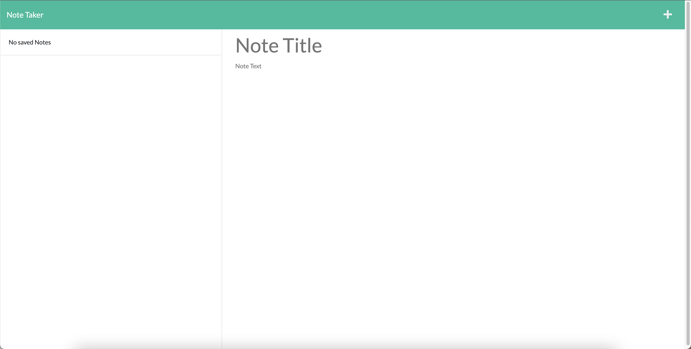

# **Note Taker**

[](#) [](#) [](#) [](#)

### :rocket: **Deployed on Heroku**

https://jasonsin88-notetaker.herokuapp.com/

---

### :spiral_notepad: **Table of Contents**

- [Description](#description)
- [How to Use](#how-to-use)
- [How to Install](#how-to-install)
- [License](#license)

# Description

Note Taker is a web-based application that allows users to take simple notes with a title and descriptive text. This application utilized Express.js back end and will save and retrieve note data from a JSON file.

There are three main features of this application:

1. When both title and text are entered, a clickable save icon will appear, allowing the user to save the note to list.
2. Click the red trash can button in the list to delete the corresponding note from the list.
3. Click the "+" button on top right corner to open a text area to create new note.

[Back to the Top](#note-taker)

## :gear: **Technologies Used**

- Node.js
- Express.js
- HTML
- CSS
- Javascript
- Bootstrap
- VS Code
- Heroku

[Back to the Top](#note-taker)

# How to Use

:floppy_disk: Once the user enters a title and some text body, a `save` button will pop on the top right corner so the user can save this note. Once saved, that note is displayed on the left.




[Back to the Top](#note-taker)

# How to Install

:cd: To install this application for local development, install the require packages, use the following command:

```bash
$ npm install
```

:desktop_computer: Once installation is done, use the following command:

```bash
$ npm start
```

The following message will be displayed:

```bash
> note-taker@1.0.0 start
> node server.js

App listening at http://localhost:3000 🚀
```

Follow the localhost link to open the app in the browser

[Back to the Top](#note-taker)

# License

[](https://opensource.org/licenses/MIT)

[Back to the Top](#note-taker)